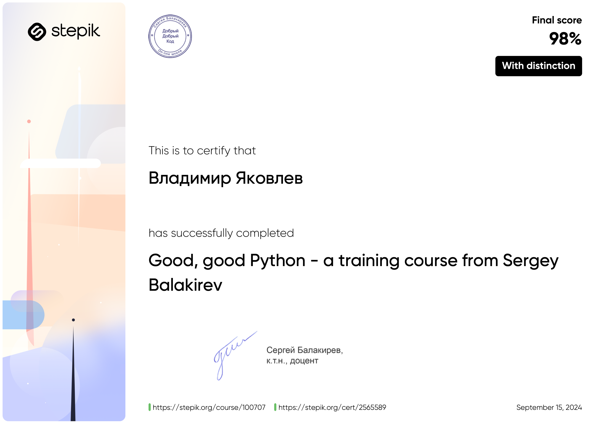

# stepik-python-base

Решаем задачки из курса Сергея Балакирева "Добрый, добрый Python"

# Информация о курсе
Добрый, добрый Python с Сергеем Балакиревым\
https://stepik.org/lesson/566987/step/1?unit=561261

# Сертификат с отличием
[Ссылка на скачивание](stepik-certificate-100707-e2dc4b9.pdf)

